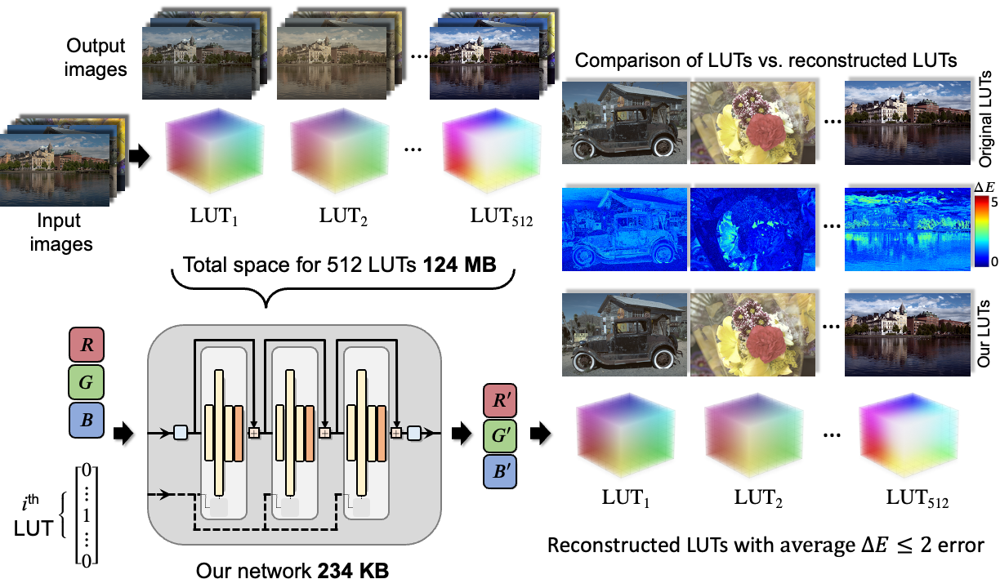

# Efficient Neural Network Embedding for 3D Color Lookup Tables

    
        
    

    <a href="" >
        .svg" alt="arXiv">
    </a>
     
     

  <a href="#how-to-use">How to Use</a> •
  <a href="#data">Data</a> •
  <a href="#experiments">Experiments</a> •
  <a href="#license">License</a> •
  <a href="#cite">Cite</a>

This repository contains the official implementation and experiments for our paper "Efficient Neural Network Embedding for 3D Color Lookup Tables", published at the 39th annual AAAI conference on Artificial Intelligence, 2025, Philadelphia, Pennsylvania, USA. This is a work in progress, and we will be updating this repository with more details and code soon. 
